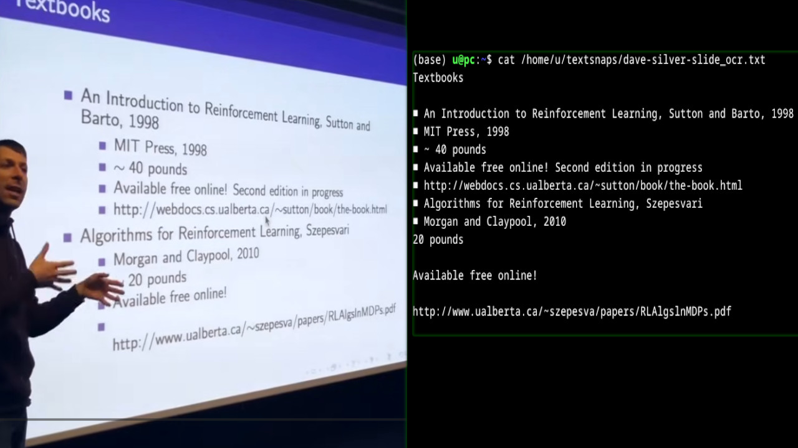

# textsnap

> **Snap any image, screenshot, or webpage into plaintext. No GPU. No cloud. One command.**




```
textsnap screenshot.png
```

That's it. You get a `.txt` next to your shell, recognized on your CPU, from a screenshot, a photo, an image URL, or even a webpage.

---

## Why textsnap

- ⚡ **Runs on CPU.** A 0.9B PaddleOCR-VL-1.5 vision-language model, quantized to q4 ONNX, parses full pages on a plain laptop. No CUDA. No M-series-only tricks. Plain old cores, pinned to your physical-core count.
- 🖼 **Images, screenshots, URLs, webpages.** Point it at a local file, a direct image URL, or a full article URL — it isolates the main content and OCRs the most prominent image. Or OCR straight from your clipboard with no argument at all.
- 📴 **Offline after first run.** ~890 MB of ONNX downloads once to your cache and stays there. No API keys. No quotas. Your images never leave your machine.
- 🪶 **One file.** The whole tool is a single Python module. Dependencies install themselves on first run if missing.
- 📝 **Markdown or plaintext.** Default output is the model's native markdown (tables, headings, structure preserved). Add `--plaintext` to flatten it.

---

## Quickstart

```
# Install
pip install textsnap

# Snap something
textsnap screenshot.png
textsnap https://example.com/article --plaintext
textsnap photo.jpg -o ~/notes/receipt.txt
```

The first run downloads the model (~890 MB). Every run after is offline.

---

## What it handles

| Source            | Example                                  |
| ----------------- | ---------------------------------------- |
| Clipboard         | `textsnap` *(no argument)*               |
| Local image file  | `textsnap path/to/img.png`               |
| Direct image URL  | `textsnap https://example.com/x.png`     |
| Webpage URL       | `textsnap https://example.com/article`   |

Local files cover anything Pillow can decode: `.png`, `.jpg`, `.jpeg`, `.webp`, `.bmp`, `.gif`, `.tiff`, and friends. For webpage URLs, textsnap uses readability to isolate the main content, then picks the most prominent image on the page and OCRs that.

---

## Install

```
pip install textsnap
```

Installs two equivalent commands on your `PATH`: **`textsnap`** (canonical) and **`ocr`** (alias, for when the name slips your mind).

To install from a local source checkout instead:

```
pip install .
```

For a reproducible install with exact pinned dependency versions:

```
pip install -r requirements-lock.txt
pip install .
```

> **Clipboard note.** Reading images from the clipboard relies on Pillow's `ImageGrab`. On Linux you may need `xclip` or `wl-clipboard` installed. macOS and Windows work out of the box.

---

## Usage

```
# Clipboard (no argument)
textsnap

# Local image file
textsnap path/to/screenshot.png

# Direct image URL
textsnap "https://example.com/diagram.png"

# Webpage — OCRs the most prominent image on the page
textsnap "https://example.com/article"

# Flatten the model's markdown to plain text
textsnap input.png --plaintext

# Custom output path
textsnap input.png -o ./out/extracted.txt

# Raise the token cap for very dense pages
textsnap dense-page.png --max-tokens 4096

# Use a local model directory instead of downloading
textsnap input.png --model-dir ~/models/paddleocr-vl
```

---

## Output

Plaintext, UTF-8. Default location is `./textsnaps/` (created if missing) under the current working directory; override with `-o`. The filename is derived from the image filename stem (`receipt_ocr.txt`), or from the webpage slug for URL inputs.

textsnap is quiet by default, Unix-style: the **only** thing printed to stdout is the path to the file it wrote, so it composes cleanly —

```
OUT=$(textsnap receipt.png)   # capture the path
textsnap receipt.png | xargs cat   # print the recognized text
```

Pass `-v` to send progress diagnostics (input type, image size, decode speed, token counts) to **stderr**; stdout stays just the path either way.

Default file output is the model's **native markdown** — it preserves tables, headings, and document structure:

```
# Quarterly Report

| Region | Revenue |
| ------ | ------- |
| EMEA   | $1.2M   |
| APAC   | $0.9M   |
```

With **`--plaintext`**, markdown is flattened to bare text:

```
Quarterly Report

Region Revenue
EMEA $1.2M
APAC $0.9M
```

---

## Flags

| Flag                  | Description                                                          |
| --------------------- | -------------------------------------------------------------------- |
| `-o`, `--output`      | Output `.txt` path. Default: `./textsnaps/<name>_ocr.txt`.           |
| `-v`, `--verbose`     | Print progress diagnostics to stderr. Off by default.                |
| `--plaintext`         | Flatten the model's native markdown to plain text.                   |
| `--model-dir`         | Use ONNX/config files from this directory instead of downloading.    |
| `--max-tokens`        | Cap generated tokens. Default `2048`. Raise it for very dense pages. |
| `--no-verify`         | Skip SHA-256 verification of downloaded model files (not advised).   |
| `--generate-checksums`| Download the pinned model files, write a fresh manifest, and exit.   |

---

## Security

textsnap auto-downloads ~890 MB of model weights from the Hugging Face Hub on first run, so it treats those files as untrusted until proven otherwise:

- **Pinned model revision.** Downloads are pinned to a specific repo revision, so a moved or retagged `main` can't silently swap the weights.
- **SHA-256 verification.** Every downloaded file is hashed and checked against known-good digests before it's loaded. A mismatch aborts the run with a clear error rather than executing unverified weights. Digests live in [`model_checksums.sha256`](model_checksums.sha256) and are also embedded in the script as a fallback, so verification works whether you install from source or from a wheel.
- **Pinned dependencies.** [`requirements-lock.txt`](requirements-lock.txt) pins exact dependency versions for reproducible installs; the file documents how to add per-wheel `--hash` entries with `pip-compile --generate-hashes` for full supply-chain pinning.

Regenerate the checksum manifest after a deliberate model-revision bump:

```
textsnap --generate-checksums
```

To bypass verification (for local experimentation with a modified model), pass `--no-verify`.

---

## How it works

1. **Load.** From the clipboard, a local file, a direct image URL, or — for a webpage URL — the most prominent image inside the page's main content (readability + a prominence heuristic).
2. **Preprocess.** The image is capped at 640px on its longest side, then run through PaddleOCR-VL's Qwen2-VL-style smart-resize and patchify, producing the pixel-value tensor and grid the vision encoder expects.
3. **Recognize.** Three ONNX components run on CPU: a vision encoder (q4), a token-embedding model (fp32), and an autoregressive decoder (q4) with a wired-up KV cache. Greedy decode, with a repetition guard that stops runaway loops early.
4. **Format.** Native markdown by default; `--plaintext` reduces it to bare text.

No image is sent anywhere. No state is kept between runs except the cached model.

---

## Model & cache

The PaddleOCR-VL-1.5 ONNX components are downloaded on first run to `~/.cache/textsnap/`:

- `onnx/vision_encoder_q4.onnx` — vision encoder + spatial-merge projector
- `onnx/decoder_q4.onnx` — autoregressive decoder
- `onnx/embedding.onnx` — token embeddings (fp32; no q4 variant exists)
- `tokenizer.json`, `config.json`

Together ~890 MB. To use your own copy, point `--model-dir` at a directory containing the same `onnx/` files plus `tokenizer.json` and `config.json`.

---

## Notes & limits

- **First run is the slow one** — it downloads ~890 MB. After that, textsnap is fully offline.
- **CPU decode is sequential.** Dense, full-page documents take longer than a short screenshot. textsnap pins thread counts to your physical cores and prints a live tokens/sec readout so a slow run is visibly alive, not hung.
- **`--max-tokens` caps the output.** Very dense pages can hit the default 2048-token cap and truncate; raise it if the tail of a page is missing.
- **Webpage inputs OCR one image** — the most prominent one in the main content, not the whole rendered page.
- **Greedy decoding** can occasionally loop on repetitive layouts; a built-in guard detects and trims these.

---

## License

MIT for this project — see [LICENSE](LICENSE).

The model is **PaddleOCR-VL-1.5**, distributed under Apache-2.0 by PaddlePaddle; textsnap pulls the ONNX export from [`onnx-community/PaddleOCR-VL-1.5-ONNX`](https://huggingface.co/onnx-community/PaddleOCR-VL-1.5-ONNX). See the [original model card](https://huggingface.co/PaddlePaddle/PaddleOCR-VL-1.5) for model terms. Powered by [onnxruntime](https://onnxruntime.ai/) and [huggingface_hub](https://github.com/huggingface/huggingface_hub).
